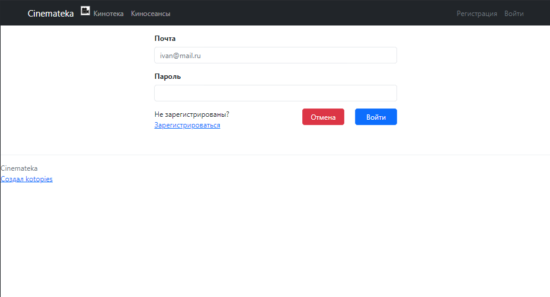
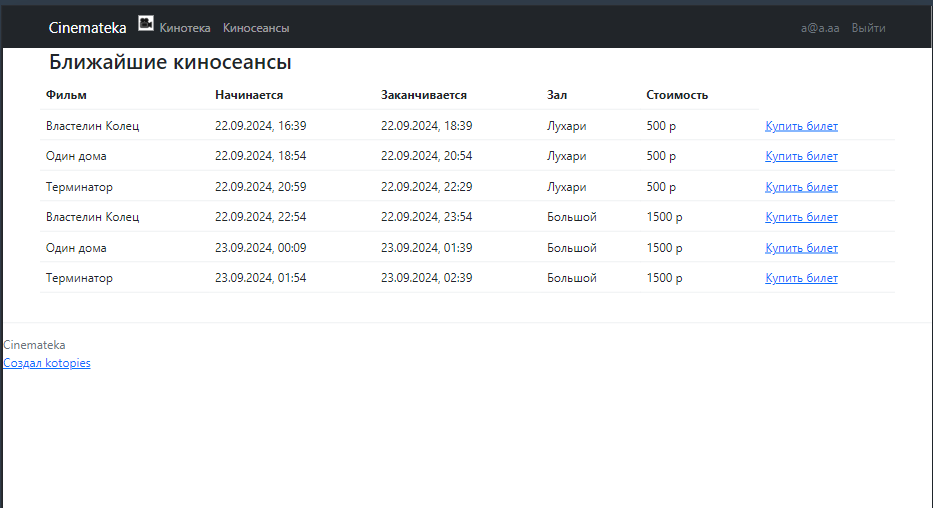
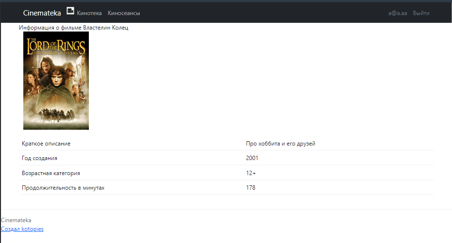
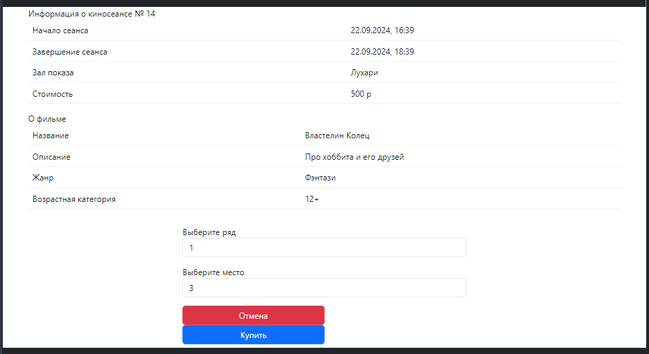

**job4j_cinema 🎦🎬 Приложение для покупки билетов в кинотеатр**

**Приложение состоит из следующих основных модулей**:

_Главная страница_:

_Регистрация/Вход_:

_Вывод киносеансов и фильмов_:

_Покупка билетов_:

# ✨✨✨✨✨✨👷‍♂️💻💻 **Разработка** 💻💻👷‍♀️✨✨✨✨✨✨

* **Стек технологий бэк**: Java 17, Spring Boot, Liquibase, Sql2o, PostgreSQL 16

* **Стек технологий фронт**: HTML, Thymeleaf, Bootstrap

* **Тестирование**: JUnit5, Mockito

* **Требования к окружению**: Java 17, Maven 3.8, PostgreSQL 16

* **Запуск проекта:** 
  Установить локально на компьютер Java 17, PostgreSQL 16
  Запустить приложение через Main.java

Контакты: telegram @kotopies 🐱‍👤
